# 캘리버로 전자책(EPUB) 파일 만들기

<b>위너책쓰기 참가 위너님들을 위한 가이드</b>

---

원래 올려드린 이북스타일리스트로 이펍을 만드는 방법을 어려워하는 분들이 계셔서 조금 더 간단한 방법을 알려드립니다.

워드(DOCX) 파일을 책처럼 잘 편집해서, 그걸로 전자책(EPUB)으로 변환하는 과정입니다. 캘리버 프로그램을 활용해서 하는 방법을 말씀드릴게요.

<div class="warning-box">
<b>참고</b><br>
저도 캘리버로 책을 만들어 서점에 올려보지는 않았지만, 알려드리기 위해 제작 후 유페이퍼에 실제 업로드를 해봤고, 오류 없이 정상 파일로 등록이 됐습니다. 이 방법을 잘 따라서 하시면 될 거예요.<br><br>
혹시 이 방법대로 한 후 유페이퍼에 업로드 하신 후 오류 수정이 필요하다는 안내를 받게 되면 저에게 이야기를 해주세요.
</div>

## 전체 흐름

```
워드 정리 → 캘리버 변환 → 오류 수정 → 뷰어 확인 → 서점 등록
```

| 단계 | 내용 |
|------|------|
| [1단계](#1단계-워드docx-파일-정리하기) | 워드 파일 정리 |
| [2단계](#2단계-캘리버-프로그램-설치) | 캘리버 설치 |
| [3단계](#3단계-캘리버로-변환하기) | 캘리버로 변환 |
| [4단계](#4단계-오류-수정--최종-파일-저장) | 오류 수정 + 저장 |
| [5단계](#5단계-서점-뷰어로-확인--수정) | 뷰어 확인 + 수정 |

---

## 캘리버란?

캘리버(Calibre)는 전 세계에서 가장 많이 쓰는 <b>무료</b> 전자책 관리 프로그램입니다.

다운로드: <b>[https://calibre-ebook.com/download](https://calibre-ebook.com/download)</b>
(Windows / Mac / Linux 모두 지원)

| 장점 | 단점 |
|------|------|
| 무료 프로그램이라 비용이 들지 않음 | 이북스타일리스트처럼 자유롭게 편집하기는 어려움 |
| 워드 파일을 바로 EPUB으로 변환 | 워드 파일 정리 상태에 따라 결과물 품질이 달라짐 |
| 표지, 목차, 이미지, 표 등 대부분 잘 변환됨 | 세밀한 수정은 HTML/CSS 지식이 필요할 수 있음 |

> <b>한 줄 요약:</b> 무료로 EPUB을 쉽게 만들 수 있지만, 이북스타일리스트만큼 세밀한 편집은 어렵습니다.

---

## 1단계. 워드(DOCX) 파일 정리하기

EPUB 변환 품질의 80%는 워드 파일 정리에서 결정됩니다.

<b>"잘 정리된 워드 = 예쁜 전자책"</b>입니다.

<div class="tip-box">
💡 <b>샘플 원고를 참고하세요</b><br>
아래 샘플 원고 파일을 함께 참고해주세요.<br>
제목 스타일, 간격, 박스, 이미지 배치 등이 어떻게 되어 있는지 직접 보시면 이해가 쉽습니다.<br>
이 파일은 <b>내용이 아닌 형식 참고용</b>이니 그 점만 참고해주세요.<br><br>
📎 <a href="나도%20책을%20쓸%20수%20있을까%20-%20샘플원고.docx" download>나도 책을 쓸 수 있을까 - 샘플원고.docx 다운로드</a>
</div>

### 1-1. 제목 스타일 적용 (가장 중요!)

캘리버는 워드의 <b>"스타일"</b>을 보고 목차와 챕터를 자동으로 만듭니다.

글꼴 크기만 키우면? 캘리버는 <b>"큰 글씨 본문"</b>으로 인식합니다. 목차에 안 잡히고, 챕터 분리도 안 됩니다.

<b>적용 방법:</b>
1. 챕터 제목 텍스트를 마우스로 선택
2. 홈 탭 → 스타일 영역에서 <b>"제목 1"</b> 클릭
3. 목차 제목은 <b>"제목 2"</b> 클릭
4. 본문은 <b>"표준"</b> (기본값, 건드리지 않아도 됨)

<div class="tip-box">
💡 <b>어디까지 선택해야 하나요?</b><br><br>
예를 들어 "Chapter1 왜 지금, 책을 써야 할까" 전체를 제목 1로 지정해도 됩니다.<br>
이 샘플에서는 디자인상 "왜 지금, 책을 써야 할까" 부분만 제목으로 선택했습니다.<br><br>
내 책의 스타일에 맞게 선택하면 됩니다.
</div>

<b>"제목 1"을 적용한 모습</b> - 왼쪽 탐색 창에 목차가 자동으로 잡힙니다:

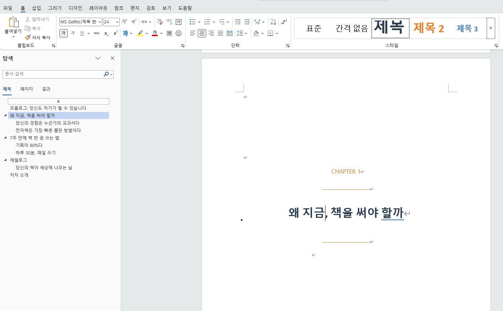

<b>"제목 2"를 적용한 모습</b> - 챕터 제목 아래 하위 항목으로 들어갑니다:

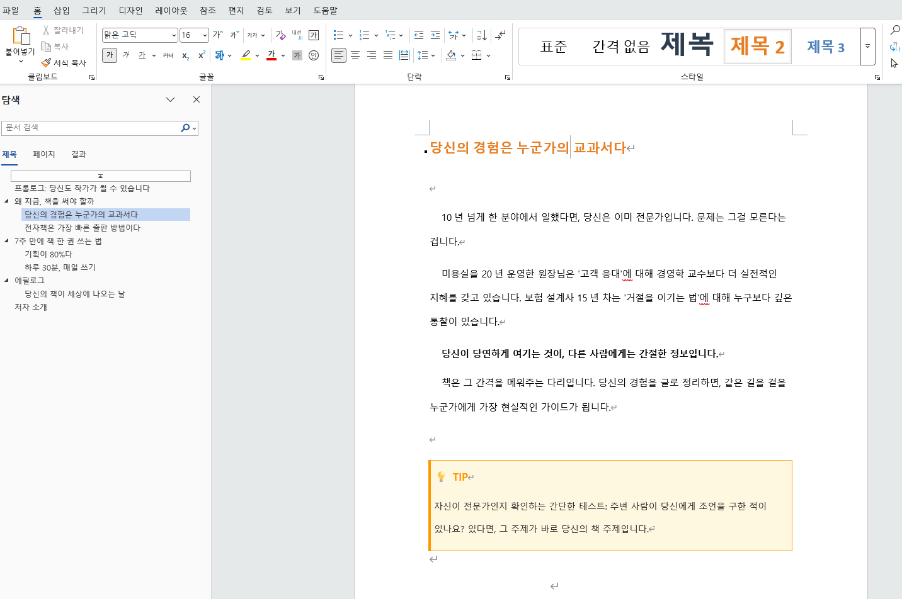

| 워드 스타일 | EPUB에서 | 설명 |
|-----------|---------|------|
| <b>제목 1</b> | 챕터 제목 + 목차 레벨 1 | 1장, 2장, 프롤로그, 에필로그 등 큰 단위 |
| <b>제목 2</b> | 목차 제목 + 목차 하위 레벨 | 각 챕터 안의 절 제목 |
| <b>표준</b> | 본문 | 기본값 그대로 |

<div class="tip-box">
💡 <b>제목 스타일을 내 책에 맞게 수정하고 싶으면</b><br><br>
홈 탭 → 스타일 영역에서 "제목 1"에 <b>마우스 오른쪽 클릭</b> → <b>"수정"</b>을 누르면<br>
글꼴, 크기, 색상 등을 자유롭게 바꿀 수 있습니다.
</div>

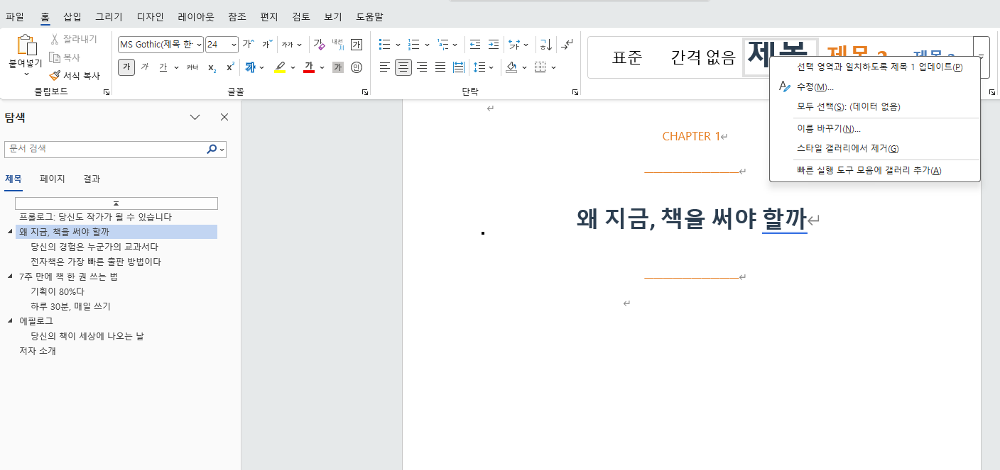

---

<b>샘플 원고의 목차 구조:</b>

```
프롤로그: 당신도 작가가 될 수 있습니다       ← 제목 1
Chapter1 왜 지금, 책을 써야 할까            ← 제목 1
  ├ 당신의 경험은 누군가의 교과서다          ← 제목 2
  └ 전자책은 가장 빠른 출판 방법이다         ← 제목 2
Chapter2 7주 만에 책 한 권 쓰는 법          ← 제목 1
  ├ 기획이 80%다                            ← 제목 2
  └ 하루 30분, 매일 쓰기                    ← 제목 2
에필로그                                    ← 제목 1
  └ 당신의 책이 세상에 나오는 날             ← 제목 2
저자 소개                                   ← 제목 1
```

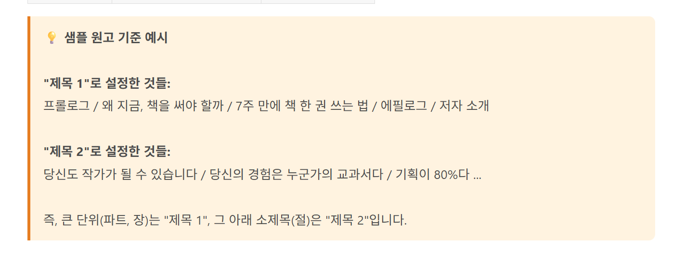

<b>예를 들면:</b>
- <b>"제목 1"</b> = 1장 제목, 2장 제목, 프롤로그, 에필로그, 저자 소개 (큰 단위)
- <b>"제목 2"</b> = 각 장 안의 절 제목 (세부 항목)

> 참고: 프롤로그, 에필로그는 "제목 2"로 설정해도 됩니다. 내 책의 구조에 맞게 선택하세요.

---

### 1-2. 간격 주기 (가독성의 핵심)

워드에서 간격이 없으면 EPUB에서도 빽빽하게 보입니다.

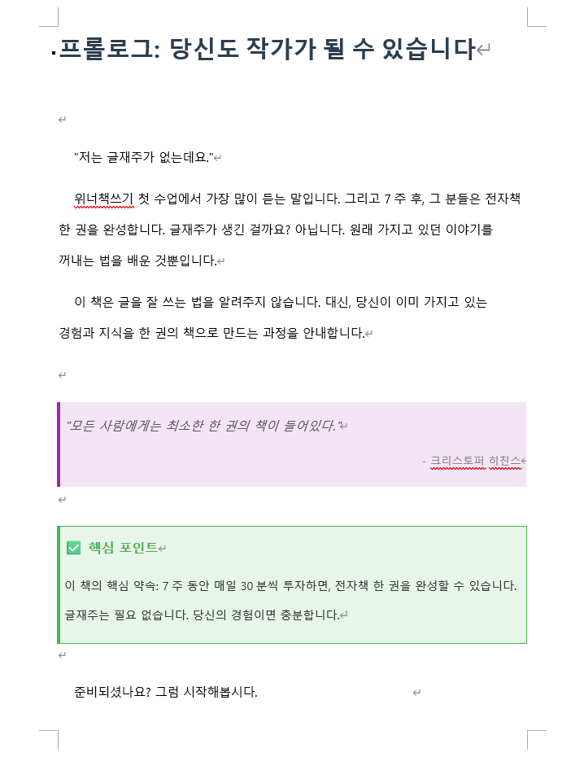

<b>지켜야 할 간격:</b>
- <b>제목 뒤</b>: 한 줄 띄우고 본문 시작
- <b>본문과 박스 사이</b>: 한 줄씩 띄우기 (박스 위아래 모두)
- <b>챕터 사이</b>: 페이지 나누기 (Ctrl+Enter)

<div class="warning-box">
⚠️ <b>주의!</b><br>
Enter를 여러 번 쳐서 페이지를 넘기면 안 됩니다.<br>
EPUB에서 빈 줄이 대량으로 생깁니다.<br>
반드시 <b>Ctrl+Enter</b>(페이지 나누기)를 사용하세요.
</div>

### 1-3. 표지 넣기

워드 파일의 <b>첫 페이지</b>에 꼭 표지 이미지를 넣어야 합니다. 그래야 캘리버가 EPUB 변환할 때 표지로 인식합니다.


- 삽입 → 그림 → 표지 이미지 선택
- 표지 뒤에 <b>페이지 나누기</b>(Ctrl+Enter)

<div class="warning-box">
⚠️ <b>표지가 첫 페이지에 없으면?</b><br>
캘리버가 표지를 인식하지 못해서 EPUB에 표지가 빠질 수 있습니다.<br>
반드시 워드 파일의 <b>첫 번째 페이지</b>에 넣어주세요.
</div>

---

### 이미지나 표가 있다면

본문에 이미지나 표가 있는 경우, 아래 내용을 꼭 읽어주세요.

### 1-4. 이미지 넣기

본문에 들어갈 이미지도 워드에서 미리 삽입합니다.

- 삽입 → 그림
- 포맷: JPG(사진) 또는 PNG(일러스트, 로고)
- 가로 폭: 1000px 이내 (너무 크면 EPUB 파일 용량이 커짐)

### 1-5. 박스/테이블 디자인

팁 박스, 인용문 같은 디자인 요소는 워드의 <b>"1x1 테이블"</b>로 만드세요.

<b>만드는 법:</b>
1. 삽입 → 표 → 1x1 표
2. 표 안에 텍스트 입력
3. 표 선택 → 디자인 탭에서 배경색, 테두리색 설정

<div class="success-box">
✅ <b>이런 디자인 요소들은 EPUB에서도 잘 변환됩니다!</b>
</div>

<b>안내/팁 박스</b> (1x1 테이블 + 배경색 + 테두리)

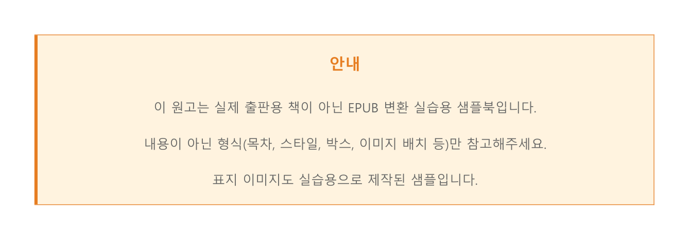

<b>인용문</b> (왼쪽 두꺼운 테두리 + 연한 배경)


<b>핵심 포인트 박스</b> (테이블 + 아이콘 + 배경색)

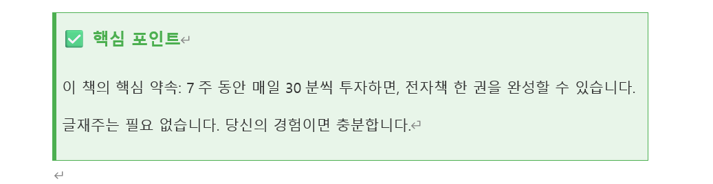

<b>비교 테이블</b> (헤더에 배경색이 있는 표)


<b>TIP 박스 / 주의 박스</b>

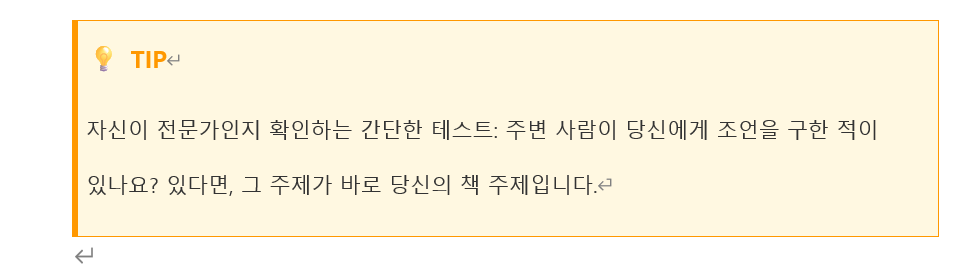

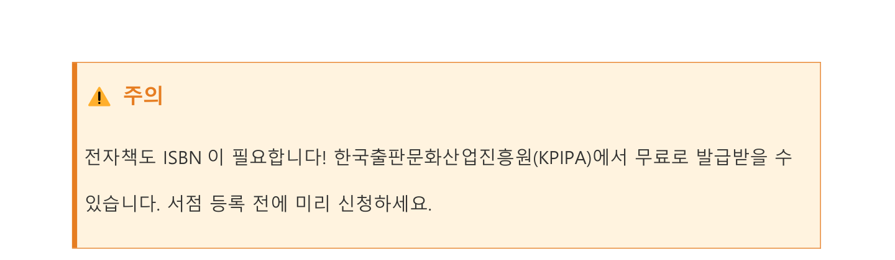

이 외에도 <b>이미지 + 캡션</b>, <b>글자 색상</b>, <b>볼드</b>, <b>이탤릭</b> 모두 보존됩니다.

### 1-6. 하면 안 되는 것

| ❌ 하면 안 되는 것 | 이유 |
|-----------------|------|
| 글꼴 크기만 키워서 제목처럼 보이게 하기 | 목차에 안 잡힘 |
| Enter 여러 번으로 페이지 넘기기 | 빈 줄이 대량 생성됨 |
| Tab이나 스페이스로 들여쓰기 | EPUB에서 깨짐 |
| 머리글/바닥글에 페이지 번호 남기기 | EPUB에서 무의미 |
| .doc으로 저장 | 캘리버에서 안 됨, 반드시 .docx |

### 1-7. 변환 전 체크리스트

- [ ] 모든 챕터 제목(1장, 2장, 프롤로그 등)에 "제목 1" 스타일 적용
- [ ] 모든 목차 제목(각 장의 절 제목)에 "제목 2" 스타일 적용
- [ ] 첫 페이지에 표지 이미지 삽입
- [ ] 각 챕터 앞에 페이지 나누기(Ctrl+Enter)
- [ ] 제목 뒤, 박스 앞뒤에 한 줄 간격
- [ ] 머리글/바닥글(페이지 번호) 삭제
- [ ] .docx로 저장

---

### AI 활용 팁 - 챗GPT, 클로드로 워드 파일 만들기

<div class="tip-box">
💡 워드 편집이 어려우시면, 워드(.docx) 파일을 AI에게 올리고 편집을 맡겨보세요.<br>
(한글(HWP) 파일은 AI가 제대로 인식을 못하니, 반드시 워드 파일로 변환 후 올려주세요.)<br><br>
원고가 텍스트 파일이나 한글로만 있다면, AI를 활용해서 워드 파일로 만들 수도 있습니다.<br><br>

<b>1) 먼저 내 책의 목차 구조를 알려주세요</b><br><br>
<code>
내 책의 구조는 이렇습니다.<br>
챕터 제목(제목 1 스타일): 프롤로그, 1장 OOO, 2장 OOO, 에필로그<br>
절 제목(제목 2 스타일): 각 장 안의 소제목들
</code><br><br>

<b>2) 챕터별로 나눠서 요청하세요</b><br>
한꺼번에 100페이지를 넣으면 AI가 내용을 빼먹거나 요약해버릴 수 있어요!<br><br>
<code>
아래는 1장 원고입니다. 워드(.docx) 파일로 만들어줘.<br>
챕터 제목은 '제목 1' 스타일, 절 제목은 '제목 2' 스타일로 적용해줘.
</code><br>
그다음 2장, 3장... 순서대로 요청합니다.<br><br>

<b>3) 첫 챕터를 받으면 워드에서 열어서 확인!</b><br>
왼쪽 탐색 창에 목차가 잡혀 있으면 성공입니다.<br>
안 잡혀 있으면 위의 1-1을 참고해서 직접 스타일을 적용해주세요.<br><br>

<b>팁:</b> AI한테 원고를 주기 전에, 적어도 각 챕터 제목 앞에 페이지 나누기(Ctrl+Enter)를 미리 넣어두면 훨씬 수월합니다. AI가 챕터 구분을 더 정확하게 인식해요.
</div>

<div class="warning-box">
⚠️ AI가 만들어준 워드 파일도 <b>반드시 확인이 필요합니다.</b><br>
제목 스타일이 빠져 있거나, 간격이 안 맞는 경우가 있어요.
</div>

---

## 2단계. 캘리버 프로그램 설치

1. <b>[https://calibre-ebook.com/download](https://calibre-ebook.com/download)</b> 접속
2. 내 컴퓨터의 운영체제에 맞는 버전 다운로드 (윈도우, 맥 버전에 따라서 받기)
3. 설치 파일 실행 → 기본 설정 그대로 "다음" 클릭하면 완료
4. 캘리버 실행

---

## 3단계. 캘리버로 변환하기

### 3-1. 워드 파일 불러오기

1. 캘리버 실행
2. 왼쪽 상단 <b>"책 추가하기"</b> 클릭
3. 워드(.docx) 파일 선택 → 열기
4. 목록에 책이 추가됨

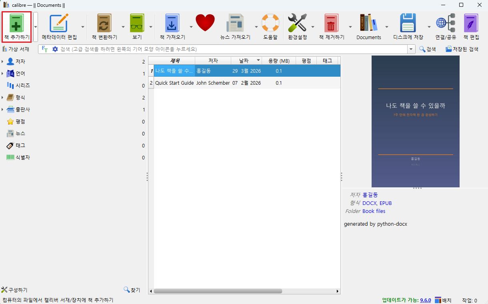

### 3-2. 변환 시작

1. 추가된 책을 클릭해서 선택
2. 상단 <b>"책 변환하기"</b> 클릭
3. 오른쪽 상단 "출력 형식"이 <b>EPUB</b>인지 확인

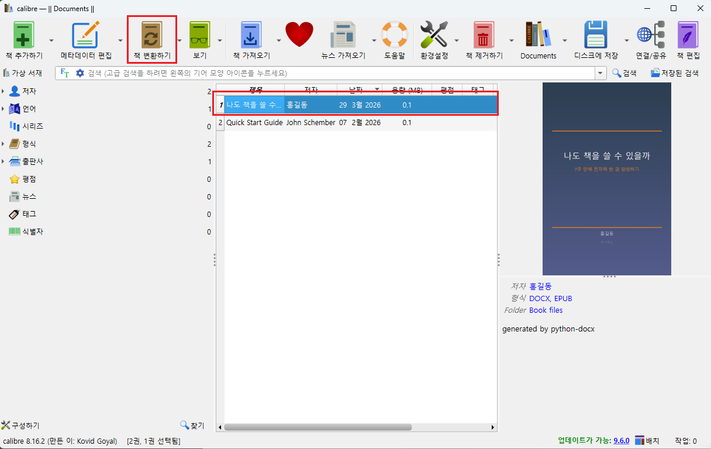

### 3-3. 변환 설정 (바꿔야 할 것만!)

대부분 기본값 그대로 두면 됩니다. <b>아래 4개만 바꾸세요.</b>

---

#### 메타데이터 ✏️

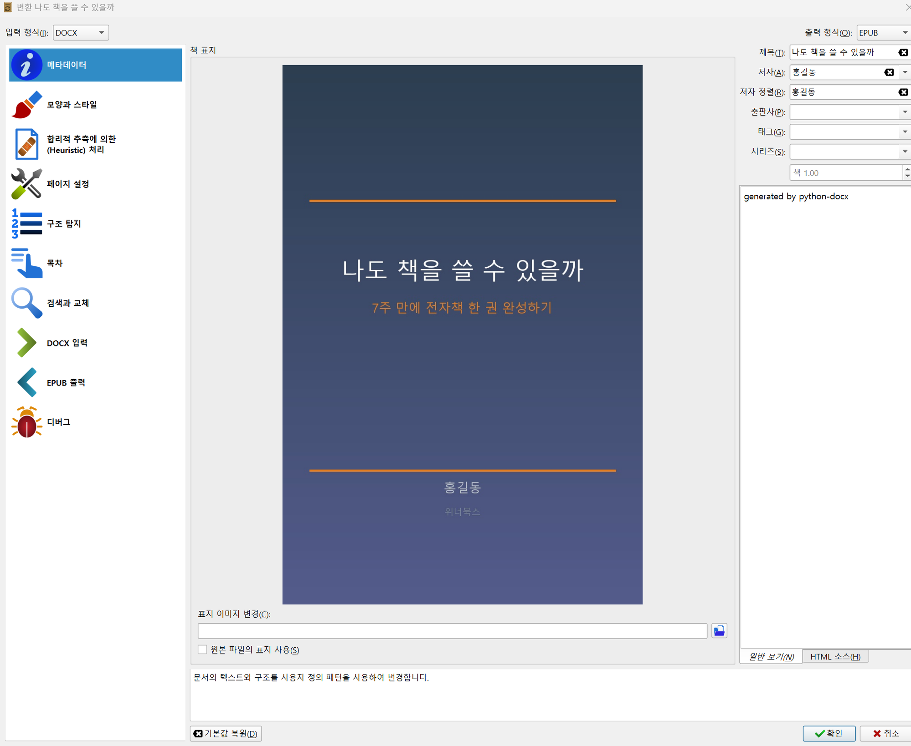

- <b>제목</b>: 책 제목 입력
- <b>저자</b>: 저자 이름 입력
- <b>설명란</b>: 자동 생성 문구가 있으면 삭제 (비워두거나 책 소개 입력)

---

#### 모양과 스타일 > 글꼴 탭 ✏️

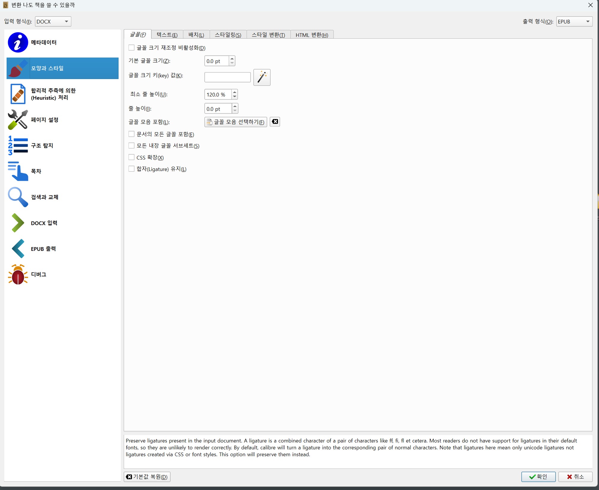

- <b>"최소 줄 높이"</b>를 120% → <b>150%</b>로 변경

한글은 줄간격이 넓어야 읽기 편합니다.

---

#### 나머지 탭들 ⏭️ 기본값 그대로!

아래 탭들은 건드리지 않아도 됩니다.

| 탭 | 할 것 |
|----|------|
| 텍스트 / 배치 / 스타일링 | 기본값 그대로 |
| 합리적 추측에 의한 처리 | 기본값 그대로 |
| 페이지 설정 | 기본값 그대로 |
| 구조 탐지 | 기본값 그대로 |
| 검색과 교체 | 기본값 그대로 |
| DOCX 입력 | 기본값 그대로 |
| EPUB 출력 | 기본값 그대로 |

---

#### 목차 ✏️

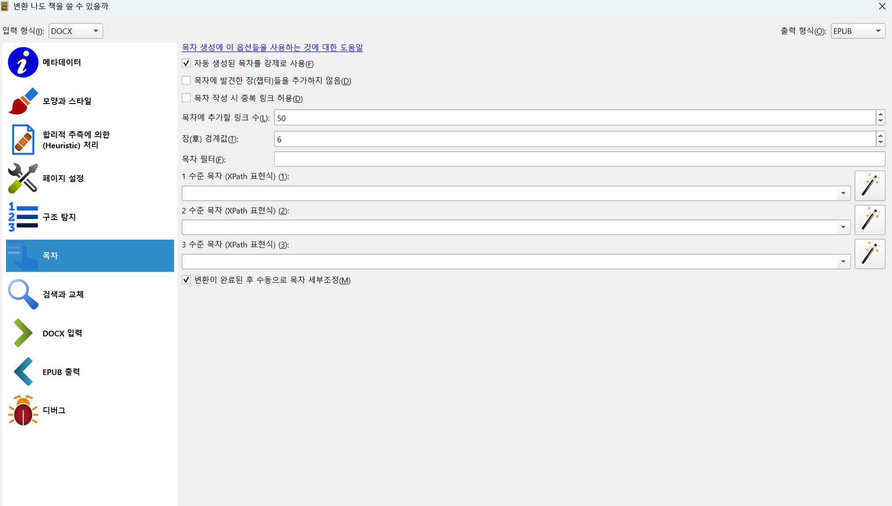

두 가지를 <b>체크</b>해주세요:

- ✅ <b>"자동 생성된 목차를 강제로 사용"</b>
- ✅ <b>"변환이 완료된 후 수동으로 목차 세부조정"</b>

---

### 3-4. 변환 실행

<b>"확인"</b> 버튼을 클릭하면 변환이 시작됩니다.

목차 세부조정을 체크했으면 <b>목차 편집 창</b>이 뜹니다.

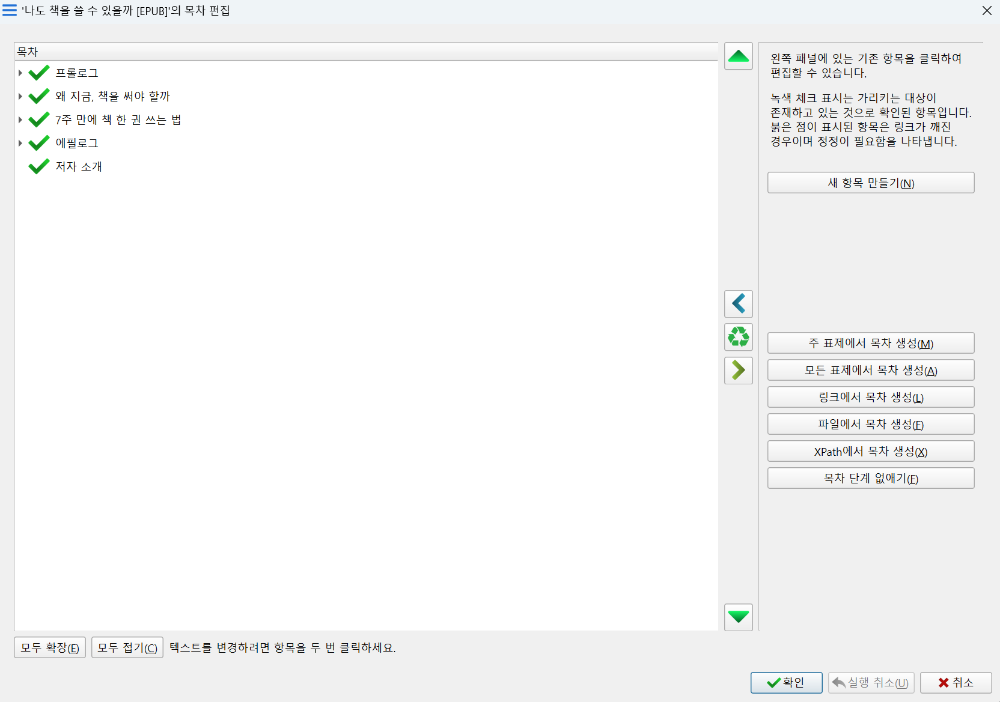

워드에서 제목 스타일을 잘 잡았으면 <b>목차가 자동으로 잡혀 있습니다.</b>

목차가 안 잡혔다면: 오른쪽 <b>"모든 표제에서 목차 생성"</b> 클릭

---

#### 목차 제목 수정하기 {docsify-ignore}

워드에서 챕터 제목을 "제목 1" 스타일로 안 했거나, 목차에 표시되는 이름을 바꾸고 싶으면 여기서 직접 수정할 수 있습니다.

<b>1) 수정할 항목을 마우스로 두 번 클릭하면</b> 이름을 수정할 수 있게 됩니다.

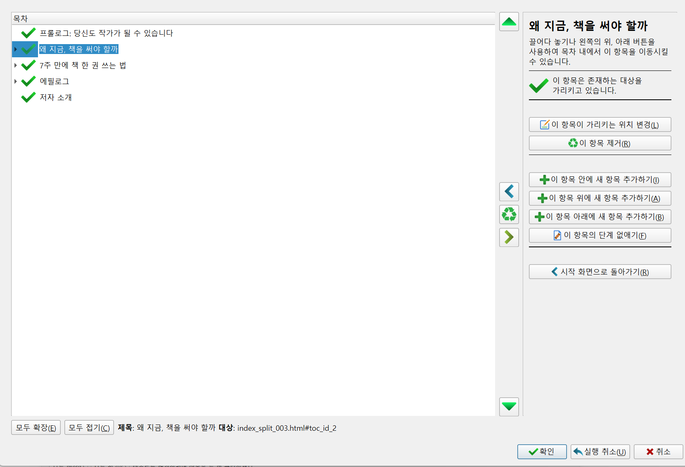

<b>2) 원하는 제목으로 수정합니다.</b> (예: "왜 지금, 책을 써야 할까" → "ch1 왜 지금, 책을 써야 할까")

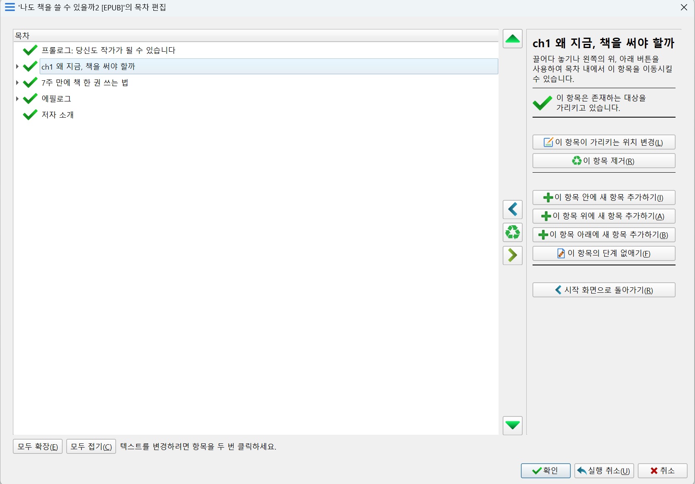

<b>3) 항목 옆의 ▶ 화살표를 누르면 하위 목차도 볼 수 있습니다.</b> 하위 항목도 확인하고 필요하면 수정하세요.

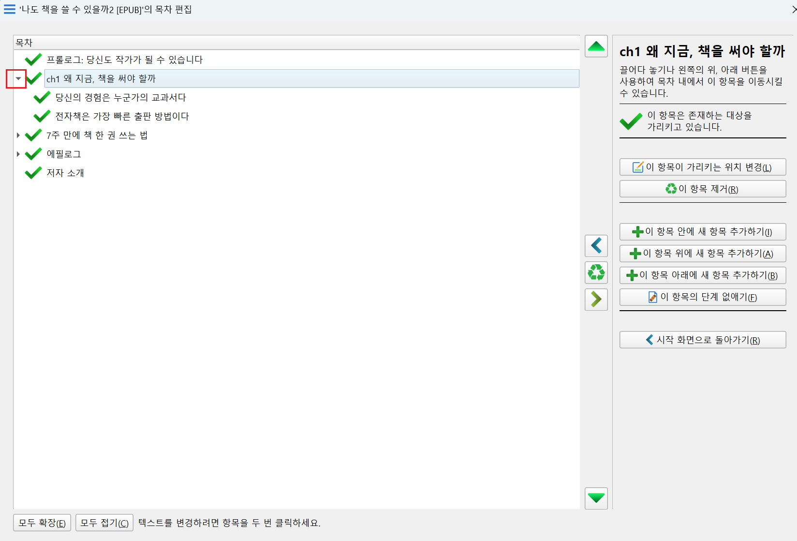

<b>4) 다 수정했으면 하단의 "확인" 버튼을 클릭합니다.</b>

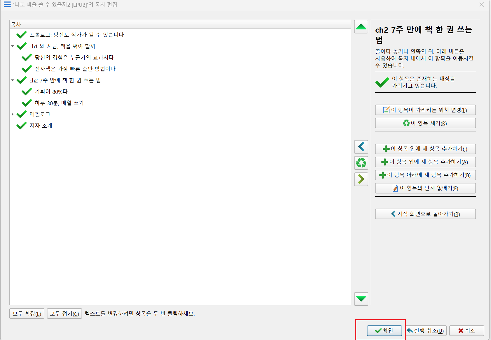

---

## 4단계. 오류 수정 + 최종 파일 저장

### 4-1. 책 편집기 열기

1. 캘리버 메인 화면으로 돌아옵니다
2. 변환된 책을 클릭해서 선택
3. 오른쪽 상단 <b>"책 편집"</b> 클릭

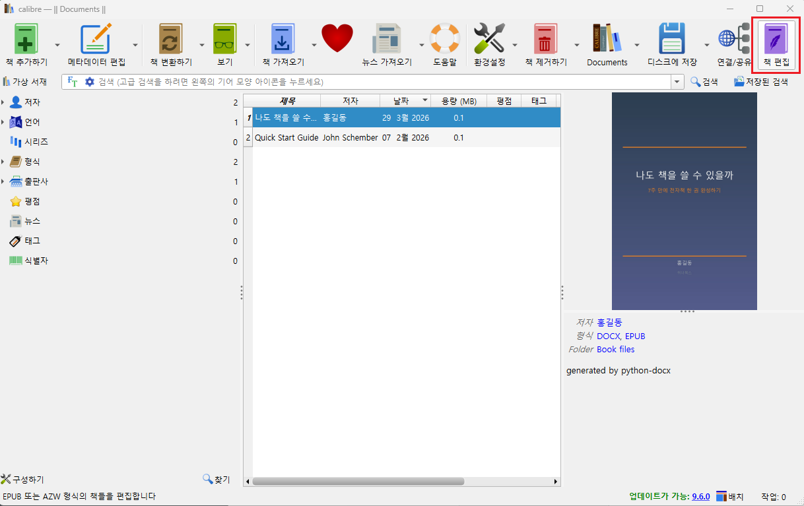

편집기가 열리면 왼쪽에 파일 목록, 가운데에 코드, 오른쪽에 미리보기가 보입니다. 코드가 복잡해 보여도 걱정하지 마세요! 우리가 할 건 간단합니다.

### 4-2. 오류 검사

1. 상단 메뉴: <b>도구</b> → <b>"책 확인하기"</b> (단축키 <b>F7</b>)

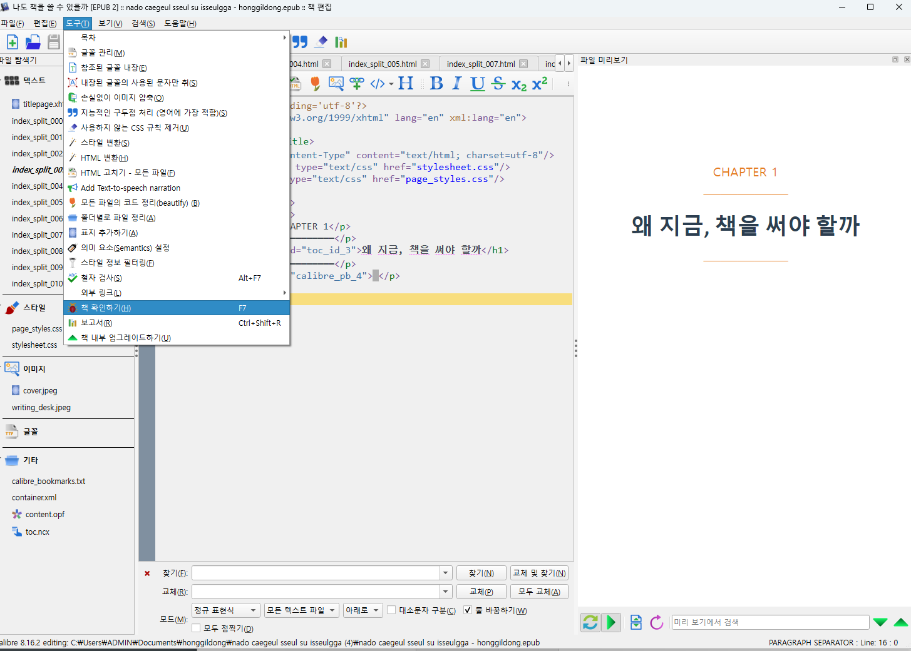


2. 오류가 없으면 "정보" 항목만 나옴
   - "이 파일 제거하기" 눌러도 되고, 그냥 둬도 됨

### 4-3. 흔한 오류: class="calibre" 제거

<div class="warning-box">
⚠️ <b>이 오류를 수정하지 않으면 유페이퍼에서 거부됩니다!</b>
</div>


캘리버가 변환할 때 자동으로 넣는 코드인데, 서점에서 "부적합한 EPUB"으로 판단합니다.

---

#### 수정 방법 1 - 정규 표현식 (추천) {docsify-ignore}

1. 상단 메뉴: <b>검색</b> → <b>찾기/교체</b> (Ctrl+F)

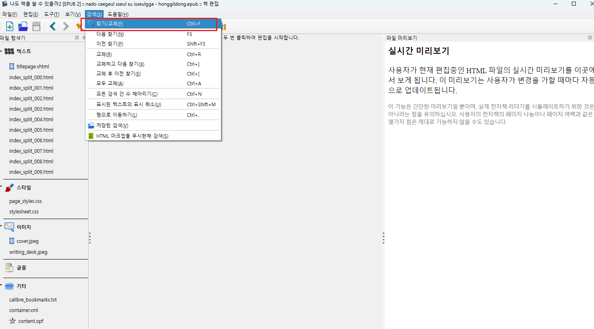

2. 모드: <b>"정규 표현식"</b>으로 변경
3. 범위: <b>"모든 텍스트 파일"</b>로 변경
4. 찾기에 입력:
```
(<html[^>]*)\s+class="calibre"
```
5. 교체에 입력:
```
\1
```

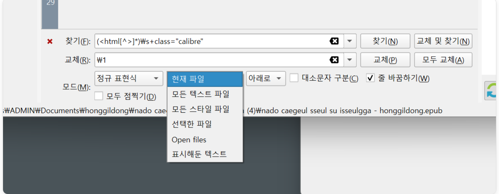

6. <b>"모두 교체"</b> 클릭
7. <b>Ctrl+S</b>로 저장
8. 다시 <b>F7</b>으로 오류 검사 → 오류 0건 확인

---

#### 수정 방법 2 - 일반 텍스트 (정규식이 어려우시면) {docsify-ignore}

1. 상단 메뉴: <b>검색</b> → <b>찾기/교체</b> (Ctrl+F)
2. 모드: <b>"일반"</b> (기본값 그대로)
3. 범위: <b>"모든 텍스트 파일"</b>로 변경
4. 찾기에 입력: ` class="calibre"` (맨 앞에 공백 한 칸 포함!)
5. 교체: <b>비워두기</b> (아무것도 입력하지 않음)
6. <b>"모두 교체"</b> 클릭
7. <b>Ctrl+S</b>로 저장
8. 다시 <b>F7</b>으로 오류 검사 → 오류 0건 확인

<div class="warning-box">
⚠️ 방법 2는 class="calibre1", class="calibre2" 같은 것까지 바뀔 수 있으니<br>
찾기에 정확히 <code> class="calibre"</code> (앞에 공백, 뒤에 숫자 없이)만 입력하세요.
</div>

### 4-4. 최종 파일 저장

오류 수정이 끝나면, EPUB 파일을 내 컴퓨터에 저장합니다.

1. 책 편집기를 닫고 캘리버 메인 화면으로 돌아갑니다
2. 책을 클릭해서 선택
3. 오른쪽 상단 <b>"디스크에 저장"</b> 클릭

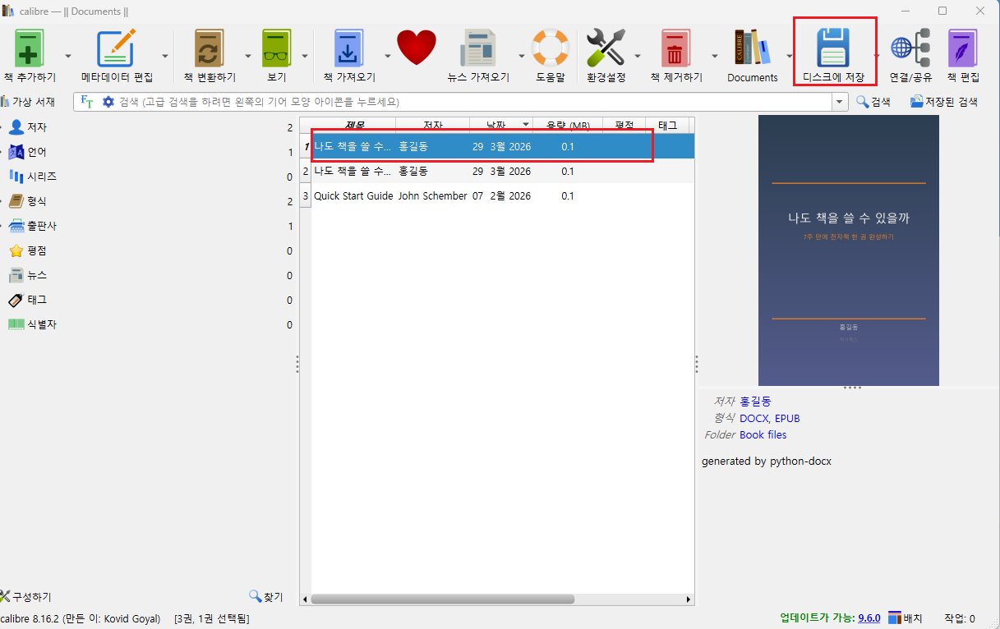

4. 저장할 폴더를 선택하고 <b>"폴더 선택"</b> 클릭

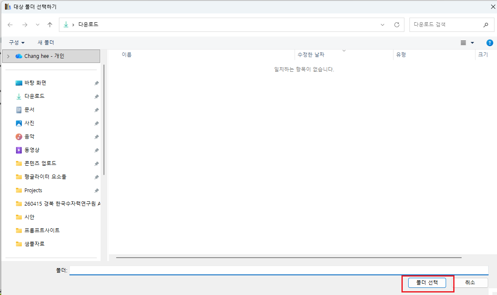

<div class="warning-box">
⚠️ 별도의 "저장" 버튼은 없습니다. <b>"폴더 선택"을 누르면 바로 저장됩니다.</b>
</div>

5. 선택한 폴더 안에 <b>저자명</b> 폴더가 생깁니다

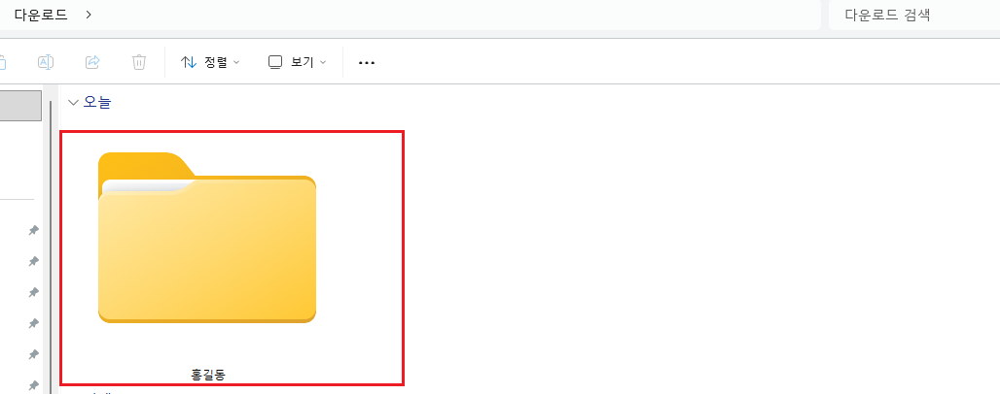

6. 저자명 폴더 → 책제목 폴더 안에 EPUB 파일이 있습니다

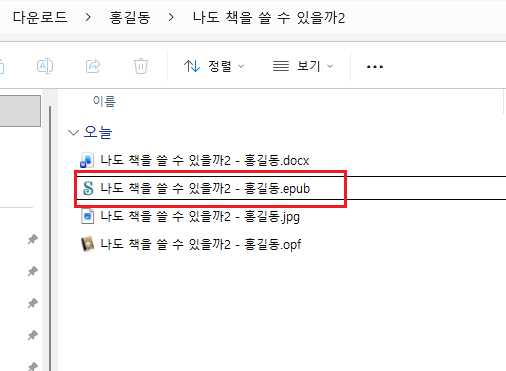

7. EPUB 파일을 원하는 위치로 복사하고, <b>파일명을 책 제목으로 변경</b>

<div class="tip-box">
💡 <b>파일명을 꼭 책 제목으로!</b><br>
예: <b>나도 책을 쓸 수 있을까.epub</b><br><br>
교보문고에 올리면 파일명이 맨 위에 제목으로 표시됩니다.
</div>

---

## 5단계. 서점 뷰어로 확인 + 수정

### 5-1. 뷰어에서 확인

EPUB 파일을 서점 뷰어에서 확인해주세요.

방법은 카페에 <b>'제작 완료 후 이펍 파일 보는 법'</b> 글을 참고해주세요.

👉 [이펍 파일 보는 법 (카페 글)](https://naver.me/xUZohIMP)

<b>확인할 것:</b>
- [ ] 표지가 잘 보이는가
- [ ] 목차가 제대로 잡혔는가
- [ ] 챕터별로 페이지가 나뉘는가
- [ ] 박스/테이블이 깨지지 않았는가
- [ ] 이미지가 잘 보이는가
- [ ] 줄간격이 적당한가 (너무 빽빽하지 않은가)
- [ ] 제목과 본문 사이 간격이 있는가

### 5-2. 수정이 필요하면

문제를 발견하면 <b>워드 파일을 수정</b>하고 다시 변환합니다.

```
워드 수정 → 캘리버 재변환 → 오류 수정 → 뷰어 확인
```

| 문제 | 해결 |
|------|------|
| 목차가 안 잡힘 | 워드에서 "제목 1/2" 스타일 확인 |
| 빈 줄이 너무 많음 | Enter 대신 페이지 나누기(Ctrl+Enter) |
| 글씨가 빽빽함 | 캘리버 최소 줄 높이 150% 설정 |
| 이미지 안 보임 | 워드에서 이미지 다시 삽입 |

보통 <b>2~3번 반복</b>하면 만족스러운 결과가 나옵니다.

---

## 핵심 3가지

1. 워드에서 <b>제목 스타일</b>(제목 1, 제목 2)을 반드시 적용할 것
2. <b>간격을 넉넉히</b> 줄 것 (제목 뒤, 박스 앞뒤)
3. 변환 후 <b>class="calibre" 오류</b>를 제거할 것

---

여기까지 따라오셨다면 <b>전자책 한 권이 완성</b>된 겁니다!

처음이라 어렵게 느껴질 수 있지만, 한 번 해보시면 그 다음부터는 금방이에요.

막히는 부분이 있으면 언제든 말씀해주세요. 같이 해결하겠습니다. 😊

---

<div style="text-align: center; padding: 2em 0 1em; color: #999; font-size: 0.9em;">
<b>스토리위너컴퍼니</b><br>
<a href="https://storywinner.co.kr" target="_blank" style="color: #E67E22;">위너책쓰기</a> 참가 위너님들을 위해 제작되었습니다.<br><br>
&copy; 2026 스토리위너컴퍼니. All rights reserved.
</div>
