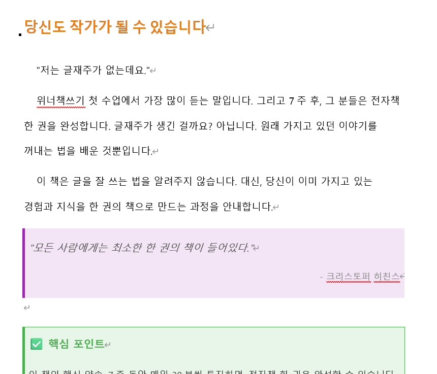

# 1단계. 워드(DOCX) 파일 정리하기

> EPUB 변환 품질의 80%는 워드 파일 정리에서 결정됩니다.

## 1-1. 제목 스타일 적용 (가장 중요!)

캘리버는 워드의 **"스타일"**을 보고 목차와 챕터를 자동으로 만듭니다.

글꼴 크기만 키우면 캘리버는 "큰 글씨 본문"으로 인식합니다. **목차에 안 잡히고, 챕터 분리도 안 됩니다.**

### 적용 방법

1. 챕터 제목 텍스트를 마우스로 선택
2. 홈 탭 → 스타일 영역에서 **"제목 1"** 클릭
3. 소챕터(절) 제목은 **"제목 2"** 클릭
4. 본문은 **"표준"** (기본값, 건드리지 않아도 됨)

> 💡 예를 들어 "Chapter1 왜 지금, 책을 써야 할까" 전체를 제목 1로 지정해도 됩니다. 이 샘플에서는 디자인상 "왜 지금, 책을 써야 할까" 부분만 제목으로 선택했습니다.

### 스타일과 EPUB의 관계

| 워드 스타일 | EPUB 변환 결과 |
|-----------|-------------|
| 제목 1 | 챕터 제목 + 목차 레벨 1 |
| 제목 2 | 소제목 + 목차 레벨 2 |
| 표준 (본문) | 일반 텍스트 |

<!-- 나중에 워드 스타일 적용 스크린샷 추가 -->

## 1-2. 간격 주기 (가독성의 핵심)

워드에서 간격이 없으면 EPUB에서도 빽빽하게 보입니다.

### 지켜야 할 간격

- **제목 뒤**: 한 줄 띄우고 본문 시작
- **본문과 박스 사이**: 한 줄씩 띄우기 (박스 위아래 모두)
- **챕터 사이**: 페이지 나누기 (Ctrl+Enter)

⚠️ <b>주의</b> 
Enter를 여러 번 쳐서 페이지를 넘기면 안 됩니다. 
EPUB에서 빈 줄이 대량으로 생깁니다. 
반드시 <b>Ctrl+Enter</b>(페이지 나누기)를 사용하세요.

## 1-3. 표지 넣기

워드 파일의 **첫 페이지**에 꼭 표지 이미지를 넣어야 합니다. 그래야 캘리버가 EPUB 변환할 때 표지로 인식합니다.

- 삽입 → 그림 → 표지 이미지 선택
- 표지 크기: **가로 800px x 세로 1200px** 권장 (3:4.5 비율)
- 표지 뒤에 **페이지 나누기**(Ctrl+Enter)

## 1-4. 이미지 넣기

본문에 들어갈 이미지도 워드에서 미리 삽입합니다.

| 항목 | 권장 |
|------|------|
| 포맷 | JPG (사진) / PNG (일러스트, 로고) |
| 가로 폭 | 1000px 이내 (너무 크면 파일 용량 증가) |
| 삽입 방법 | 삽입 → 그림 |

## 1-5. 박스/테이블 디자인

팁 박스, 인용문, 핵심 포인트 같은 디자인 요소는 워드의 **"1x1 테이블"**로 만드세요.

### 만드는 법

1. 삽입 → 표 → 1x1 표
2. 표 안에 텍스트 입력
3. 표 선택 → 디자인 탭에서 배경색, 테두리색 설정

EPUB으로 변환해도 이런 디자인이 그대로 유지됩니다!

**안내/팁 박스** (1x1 테이블 + 배경색 + 테두리)

**인용문** (왼쪽 두꺼운 테두리 + 연한 배경)

**핵심 포인트 박스** (테이블 + 아이콘 + 배경색)

**비교 테이블** (헤더에 배경색이 있는 표)

**TIP 박스 / 주의 박스**

이 외에도 **이미지 + 캡션**, **글자 색상**, **볼드**, **이탤릭** 모두 보존됩니다.

> *위 이미지들은 샘플 원고의 예시입니다. 똑같이 만들 필요 없이, 내 책에 맞는 스타일로 자유롭게 꾸미면 됩니다.*

## 1-6. 하면 안 되는 것

| ❌ 하면 안 되는 것 | 이유 |
|-----------------|------|
| 글꼴 크기만 키워서 제목처럼 보이게 하기 | 목차에 안 잡힘 |
| Enter 여러 번으로 페이지 넘기기 | 빈 줄이 대량 생성됨 |
| Tab이나 스페이스로 들여쓰기 | EPUB에서 깨짐 |
| 머리글/바닥글에 페이지 번호 남기기 | EPUB에서 무의미 |
| .doc으로 저장 | 캘리버에서 안 됨, 반드시 .docx |

## 1-7. 변환 전 체크리스트

- [ ] 모든 챕터 제목에 "제목 1" 스타일 적용
- [ ] 모든 소제목에 "제목 2" 스타일 적용
- [ ] 첫 페이지에 표지 이미지 삽입
- [ ] 각 챕터 앞에 페이지 나누기(Ctrl+Enter)
- [ ] 제목 뒤, 박스 앞뒤에 한 줄 간격
- [ ] 머리글/바닥글(페이지 번호) 삭제
- [ ] .docx로 저장
