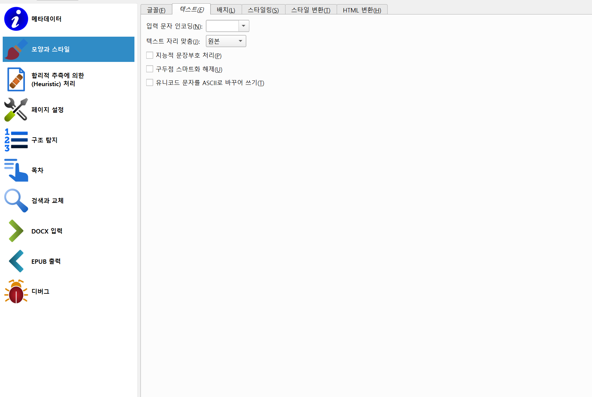
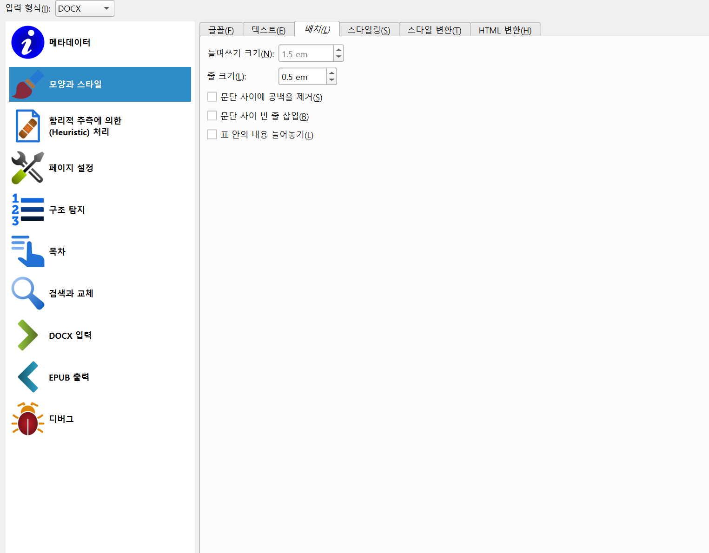
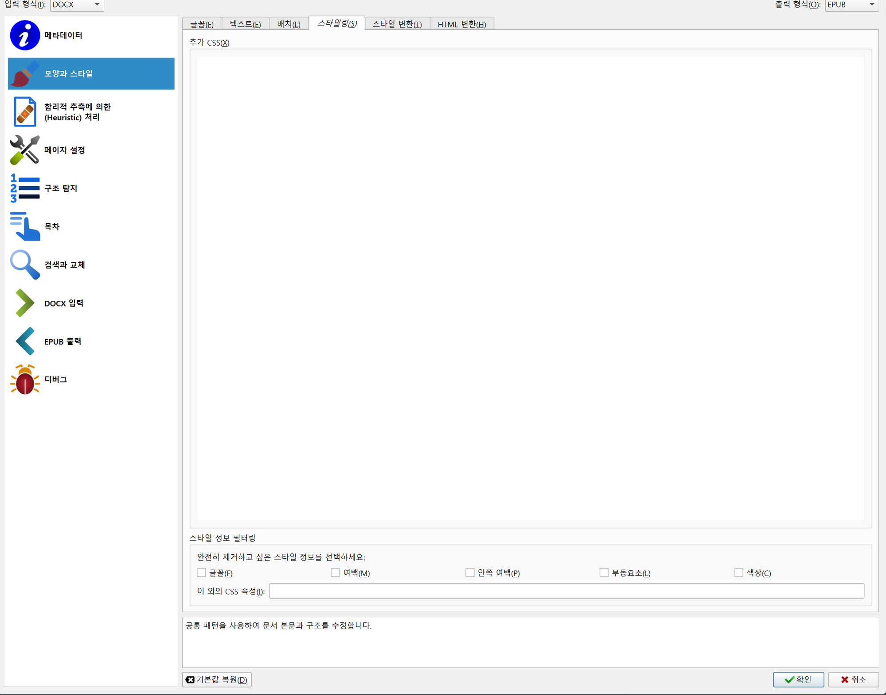
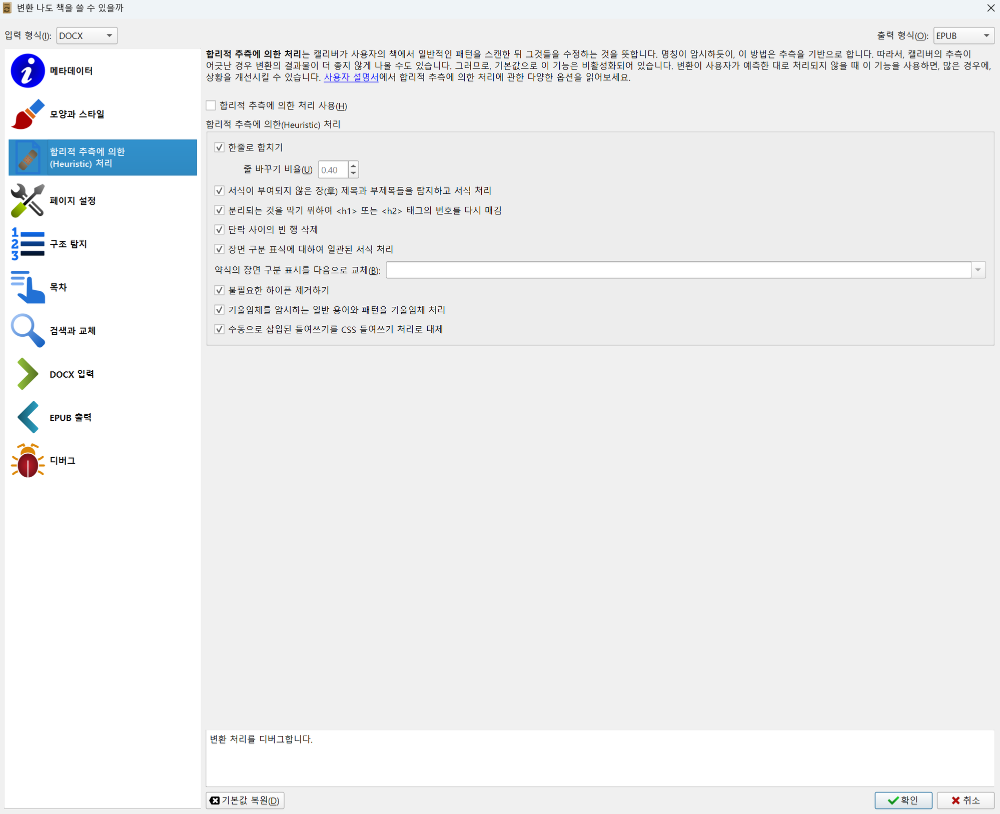
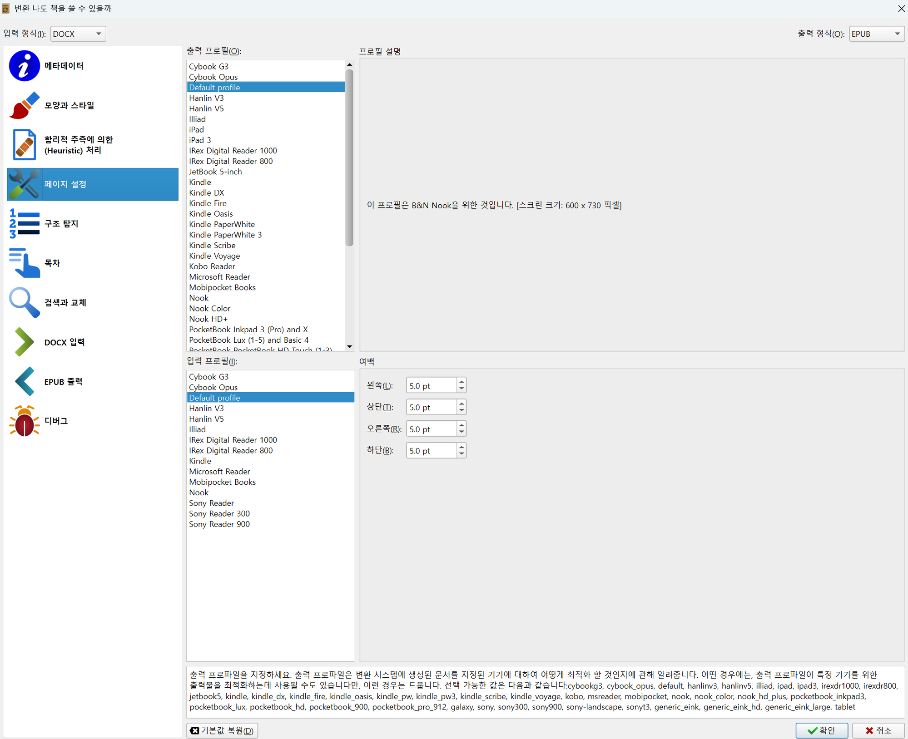
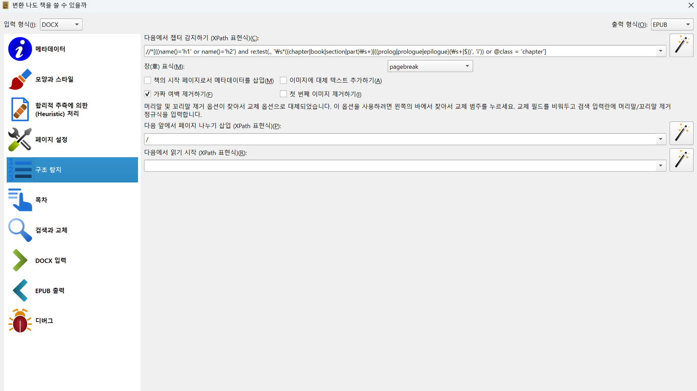
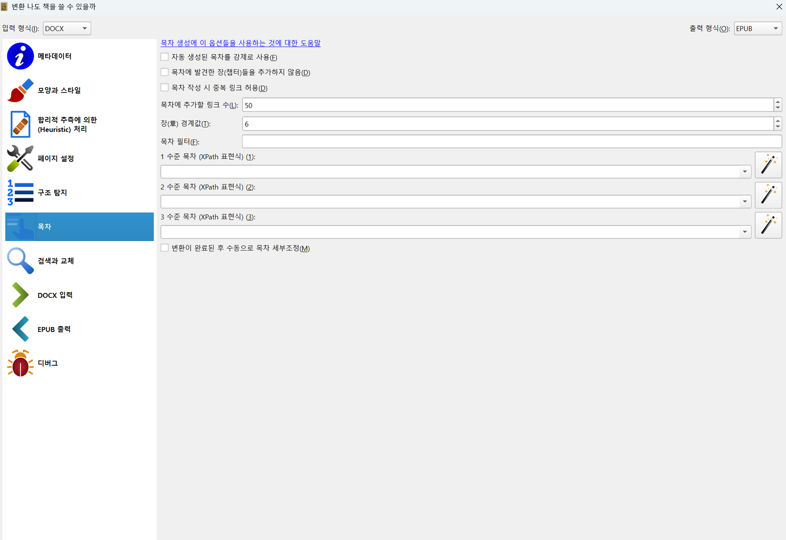

# 3단계. 캘리버로 변환하기

> 설정은 4개만 바꾸면 됩니다. 나머지는 전부 기본값!

## 3-1. 워드 파일 불러오기

1. 캘리버 실행
2. 왼쪽 상단 **"책 추가하기"** 클릭
3. 워드(.docx) 파일 선택 → 열기
4. 목록에 책이 추가됨

## 3-2. 변환 시작

1. 추가된 책을 클릭해서 선택
2. 상단 **"책 변환하기"** 클릭
3. 오른쪽 상단 **"출력 형식"**이 **EPUB**인지 확인

## 3-3. 변환 설정

왼쪽 메뉴를 하나씩 살펴보겠습니다. **대부분 기본값 그대로** 두면 됩니다.

---

### 메타데이터 ✏️ 바꿔야 함

바꿀 것:
- **제목**: 책 제목 입력
- **저자**: 저자 이름 입력
- **설명란**: "generated by python-docx" 같은 자동 생성 문구가 있으면 삭제

💡 <b>참고</b> 
출판사, 태그 등은 선택사항입니다. 비워둬도 됩니다.

---

### 모양과 스타일 > 글꼴 탭 ✏️ 바꿔야 함

바꿀 것:
- **"최소 줄 높이"**: 120% → **150%**로 변경

한글은 줄간격이 넓어야 읽기 편합니다. 120%면 너무 빽빽해 보입니다.

나머지(글꼴 크기, 글꼴 모음 포함 등)는 건드리지 않아도 됩니다.

---

### 모양과 스타일 > 텍스트 탭 ⏭️ 기본값

건드릴 것 없음. 기본값 그대로 넘어갑니다.

---

### 모양과 스타일 > 배치 탭 ⏭️ 기본값

건드릴 것 없음. 들여쓰기 1.5em, 줄 크기 0.5em 기본값 OK.

---

### 모양과 스타일 > 스타일링 탭 ⏭️ 기본값

추가 CSS 비어있는 상태 그대로 OK. 워드 원본 스타일이 유지됩니다.

---

### 합리적 추측에 의한(Heuristic) 처리 ⏭️ 기본값

맨 위 체크박스가 꺼져있으면 OK. 워드에서 제목 스타일을 잘 잡았으면 추측 기능이 필요 없습니다.

---

### 페이지 설정 ⏭️ 기본값

출력/입력 프로필 모두 **"Default profile"** 그대로.

한국 서점(교보/리디/밀리)은 범용 뷰어를 쓰므로 Default가 맞습니다.

---

### 구조 탐지 ⏭️ 기본값

챕터 감지, 페이지 나누기 모두 기본값 그대로 OK.

---

### 목차 ✏️ 바꿔야 함

**변경 전:**

**변경 후:**

바꿀 것:
- **"자동 생성된 목차를 강제로 사용"** 체크 ON
- **"변환이 완료된 후 수동으로 목차 세부조정"** 체크 ON

💡 <b>왜 체크하나요?</b> 
- "강제로 사용": 워드 원본에 목차가 없어도 제목 스타일 기반으로 자동 생성 
- "수동 세부조정": 변환 후 목차를 직접 확인하고 수정할 수 있는 편집 창이 뜸

---

### 나머지 메뉴 ⏭️ 전부 기본값

- **검색과 교체**: 기본값
- **DOCX 입력**: 기본값
- **EPUB 출력**: EPUB 버전 2 (기본값, 한국 서점 호환성 최고)
- **디버그**: 기본값

## 3-4. 변환 실행

**"확인"** 버튼을 클릭하면 변환이 시작됩니다.

목차 세부조정을 체크했으면 아래와 같은 **목차 편집 창**이 뜹니다.

워드에서 제목 스타일을 잘 잡았으면 **목차가 자동으로 잡혀 있습니다**.

### 목차가 잘 잡혔을 때

- 녹색 체크(✅) = 정상적으로 연결된 항목
- ▶ 삼각형 클릭하면 하위 목차(소제목)가 펼쳐짐
- 그대로 **"확인"** 클릭

### 목차가 안 잡혔을 때

오른쪽 버튼 활용:
- **"모든 표제에서 목차 생성"**: 제목 태그 기반으로 다시 생성
- **"주 표제에서 목차 생성"**: 큰 제목만 가져오기

### 목차 수동 편집

- **더블클릭**: 항목 이름 수정
- **▲▼ 화살표**: 순서 변경
- **◀▶ 화살표**: 레벨 올리기/내리기

## 설정 요약

전체 메뉴 중 **바꾼 건 딱 4개**:

| 메뉴 | 변경 사항 |
|------|----------|
| 메타데이터 | 제목/저자 입력, 설명란 정리 |
| 모양과 스타일 > 글꼴 | 최소 줄 높이 120% → **150%** |
| 목차 | "자동 생성된 목차를 강제로 사용" **체크** |
| 목차 | "변환 후 수동으로 목차 세부조정" **체크** |
