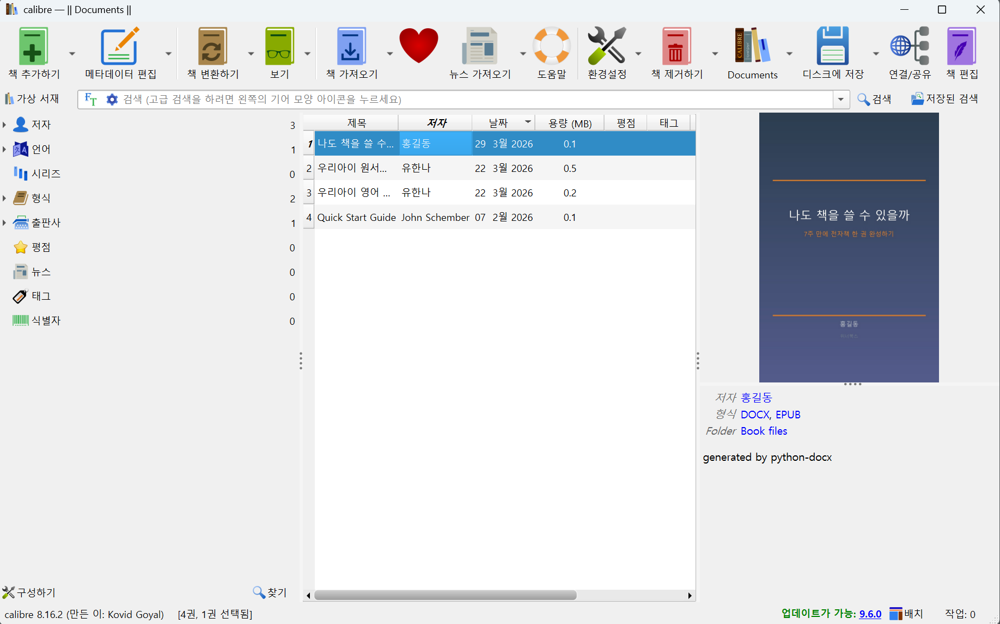
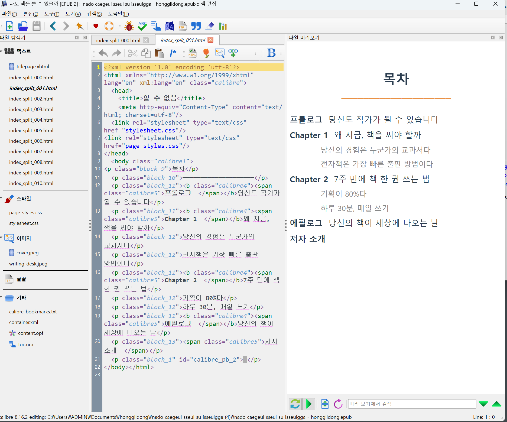
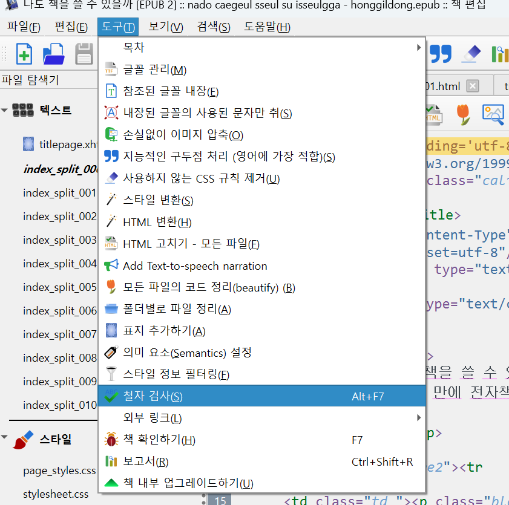
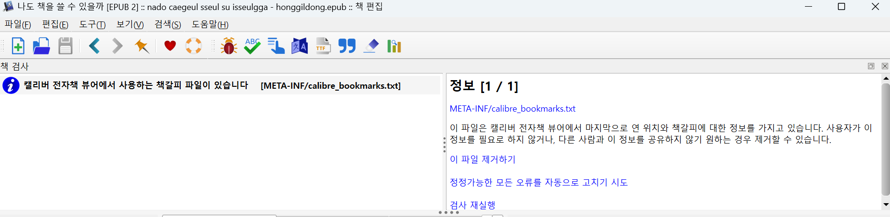
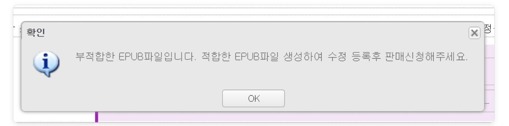
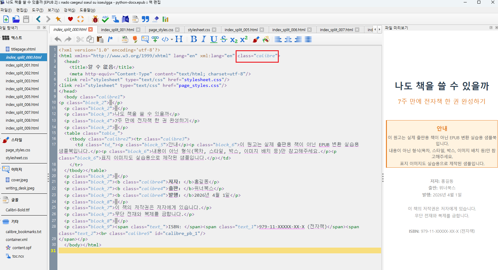
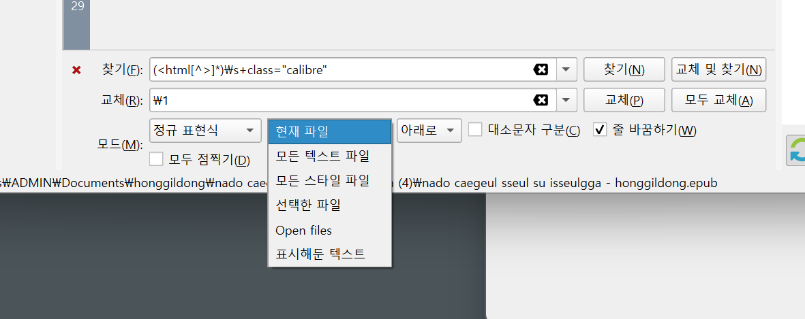

# 4단계. 오류 수정 + 최종 파일 저장

> 변환 후 한 가지만 수정하면 서점 등록이 가능합니다.

## 4-1. 책 편집기 열기

변환이 완료되면 캘리버 메인 화면으로 돌아옵니다.



1. 변환된 책을 클릭해서 선택
2. 오른쪽 상단 **"책 편집"** 클릭

그러면 아래와 같은 편집기가 열립니다.



편집기 구성:
- **왼쪽**: 파일 탐색기 (HTML, CSS, 이미지 등)
- **가운데**: 소스 코드 편집
- **오른쪽**: 실시간 미리보기

## 4-2. 오류 검사



1. 상단 메뉴: **도구** → **"책 확인하기"** (단축키 **F7**)



2. 결과 확인
   - 오류가 없으면 **"정보"** 항목만 나옴
   - `calibre_bookmarks.txt` 관련 정보는 무시해도 됨 ("이 파일 제거하기" 눌러도 OK)

## 4-3. 필수 오류 수정: class="calibre" 제거

<div class="warning-box">
⚠️ <b>이 단계를 건너뛰면 서점에서 거부됩니다!</b><br>
캘리버가 변환 시 html 태그에 class="calibre"를 넣는데,<br>
유페이퍼 같은 서점에서 "부적합한 EPUB"으로 거부합니다.
</div>



### 문제 위치

각 HTML 파일의 2번 줄을 보면 이렇게 되어 있습니다:



```html
<html xmlns="..." lang="en" xml:lang="en" class="calibre">
```

이 `class="calibre"` 부분을 제거해야 합니다.

### 수정 방법 (검색/교체로 한번에!)



1. 상단 메뉴: **검색** → **찾기/교체** (단축키 **Ctrl+F**)
2. 모드를 **"정규 표현식"**으로 변경
3. 범위를 **"모든 텍스트 파일"**로 변경
4. 아래 내용 입력:

**찾기:**
```
(<html[^>]*)\s+class="calibre"
```

**바꾸기:**
```
\1
```

5. **"모두 교체"** 클릭
6. **Ctrl+S**로 저장
7. 다시 **F7**으로 오류 검사 → 오류 0건 확인

<div class="success-box">
✅ <b>확인</b><br>
이 정규식은 &lt;html&gt; 태그의 class="calibre"만 제거합니다.<br>
&lt;body class="calibre1"&gt; 같은 다른 class는 건드리지 않습니다.
</div>

## 4-4. 책 편집기에서 할 수 있는 다른 것들

도구 메뉴에는 유용한 기능이 더 있습니다:

| 메뉴 | 기능 |
|------|------|
| 목차 | 목차 편집 |
| 사용하지 않는 CSS 규칙 제거 | 불필요한 CSS 정리 |
| 손실없이 이미지 압축 | 파일 용량 줄이기 |
| 모든 파일의 코드 정리(beautify) | HTML 코드를 깔끔하게 |

## 4-5. EPUB 파일 이름 설정

<div class="tip-box">
💡 <b>중요!</b><br>
파일명을 책 제목으로 맞춰주세요.<br>
예: <b>나도 책을 쓸 수 있을까.epub</b><br><br>
교보문고에 업로드하면 이 파일명이 맨 위에 제목으로 표시됩니다.
</div>

## 4-6. 최종 파일 저장

1. 캘리버 메인 화면에서 책 선택
2. 오른쪽 상단 **"디스크에 저장"** 클릭
3. 저장할 폴더 선택 → **"폴더 선택"** 클릭

<div class="warning-box">
⚠️ <b>주의</b><br>
별도의 "저장" 버튼은 없습니다.<br>
<b>"폴더 선택"을 누르면 바로 저장됩니다.</b>
</div>

4. 선택한 폴더 안에 `저자명/책제목/` 폴더가 생기고, 그 안에 EPUB 파일이 있음
5. EPUB 파일을 원하는 위치로 복사하고, **파일명을 책 제목으로 변경**
