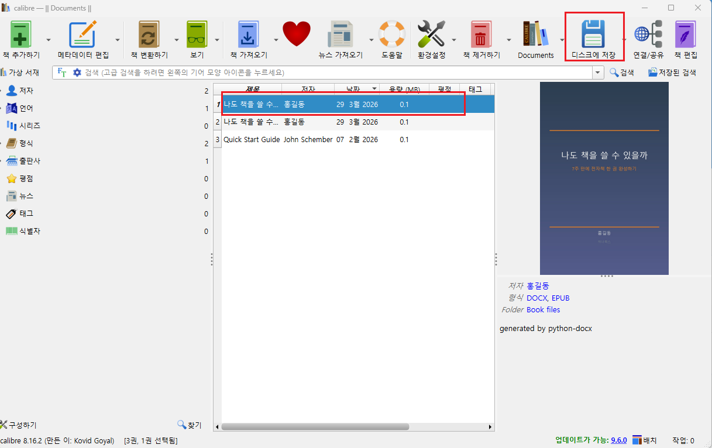
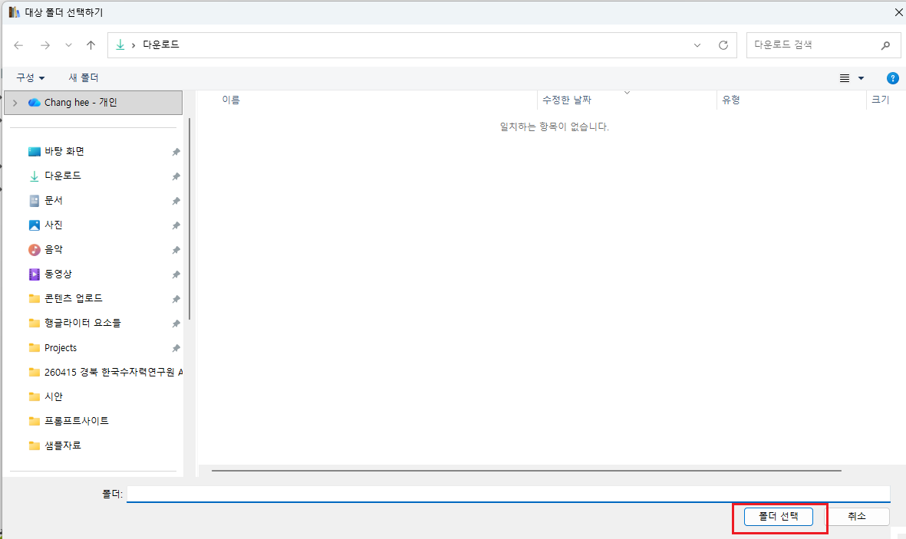
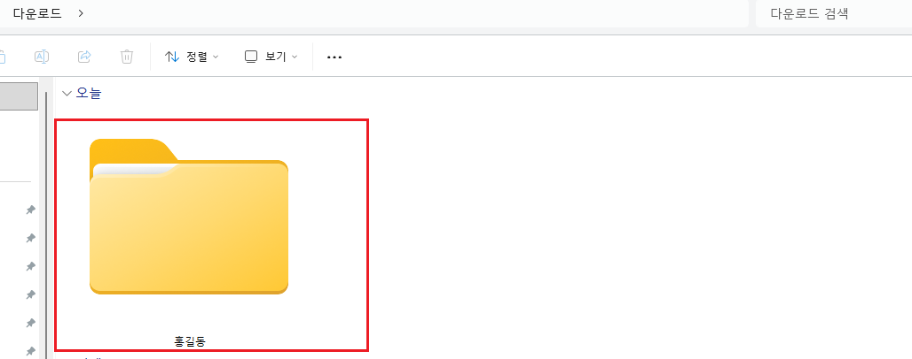
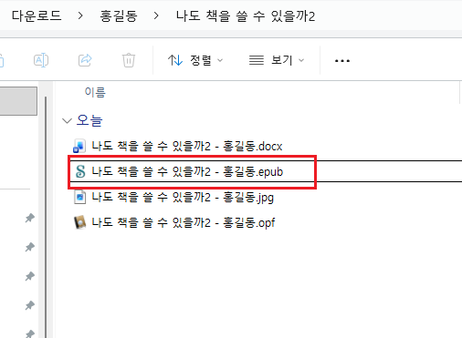

# 4단계. 최종 파일 저장

> 변환이 끝나면 파일로 저장해서 마무리합니다.

## 4-1. EPUB 파일 이름 설정

💡 <b>중요!</b> 
파일명을 책 제목으로 맞춰주세요. 
예: <b>나도 책을 쓸 수 있을까.epub</b>  
교보문고에 업로드하면 이 파일명이 맨 위에 제목으로 표시됩니다.

## 4-2. 최종 파일 저장

1. 캘리버 메인 화면에서 책 선택
2. 오른쪽 상단 **"디스크에 저장"** 클릭

3. 저장할 폴더를 선택하고 **"폴더 선택"** 클릭

⚠️ <b>주의</b> 
별도의 "저장" 버튼은 없습니다. 
<b>"폴더 선택"을 누르면 바로 저장됩니다.</b>

4. 선택한 폴더 안에 **저자명** 폴더가 생깁니다

5. 저자명 폴더 → 책제목 폴더 안에 EPUB 파일이 있습니다

6. EPUB 파일을 원하는 위치로 복사하고, **파일명을 책 제목으로 변경**
